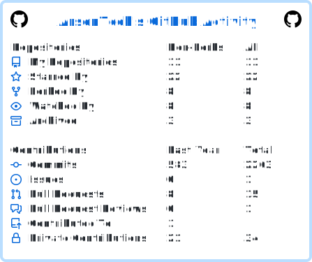
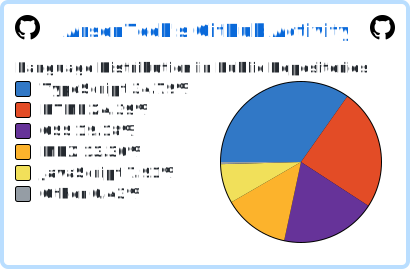

  

<h1 align="center">Hello There 👋, I am Arsen - a.k.a. <a href="https://arsentech.github.io/">ArsenTech</a></h1>

  
  
  
  

<h3 align="center">Programmer, Developer, Tech Youtuber from 🇦🇲 Armenia 🇦🇲</h3>

### Short Information
- 🔭 I’m currently working on **Programming & Video Editing**
- 💬 Ask me about **Anything Tech-related**
- 📫 How to reach me: **[Follow Me](#follow-me)** or **[Contact Me](https://arsentech.github.io/#contact)**
- 😄 Pronouns: **He / Him**
- ⚡ Fun Fact: My Hobbies are **Travelling, and YouTube**
- 💻 Do You Want to learn Coding? **Visit [Here][yt-coding-url]**

### Follow Me
[![YouTube][yt-arsentech-shield]][yt-arsentech-url]
[![Patreon][patreon-shield]][patreon-url]
[![Codepen][codepen-shield]][codepen-url]
[![DeviantArt][deviantart-shield]][deviantart-url]
[![Odysee][odysee-shield]][odysee-url]
[![Scratch][scratch-shield]][scratch-url]

### My Other YouTube Channels
[![YouTube Shorts Channel][yt-shorts-shield]][yt-shorts-url]
[![YouTube Misc Channel][yt-misc-shield]][yt-misc-url]
[![YouTube Coding Channel][yt-coding-shield]][yt-coding-url]

### Language And Tools
#### Main Skills
[![Git][git-shield]][git-url]
[![ShadCN UI][shadcn-shield]][shadcn-url]
[![HTML][html-shield]][html-url]
[![CSS][css-shield]][css-url]
[![Javascript][js-shield]][js-url]
[![Node JS][nodejs-shield]][nodejs-url]
[![React][react-shield]][react-url]
[![Tailwind CSS][tailwind-shield]][tailwind-url]
[![Typescript][ts-shield]][ts-url]
[![Next JS][nextjs-shield]][nextjs-url]
[![MongoDB][mongodb-shield]][mongodb-url]
[![Socket.io][socket-io-shield]][socket-io-url]
[![Tauri][tauri-shield]][tauri-url]
[![PostgreSQL][postgresql-shield]][postgresql-url]

#### Secondary Skills
[![Sass][sass-shield]][sass-url]
[![Angular][angular-shield]][angular-url]
[![C#][csharp-shield]][csharp-url]
[![MySQL][mysql-shield]][mysql-url]
[![PHP][php-shield]][php-url]
---

### :tv: Latest YouTube Videos

<!-- YOUTUBE:START -->
- [Different Year Bugs on Windows NT 4.0! | Christmas Special](https://www.youtube.com/watch?v=cRDT692sOzI)
- [Dr. Web Antivirus VS The NoEscape.exe Malware | Antivirus Test](https://www.youtube.com/watch?v=AsmuclNETVM)
- [Make Your Linux Mint Terminal Look Modern! &lpar;Fish + Oh My Posh + Bash&rpar;](https://www.youtube.com/watch?v=joCLQhCqP4E)
- [Quick Heal Total Security VS The MEMZ Trojan | Insane Antivirus Test](https://www.youtube.com/watch?v=noCzuelaGOY)
- [I Just Shred The Entire Windows 7 System | The Ultimate Windows Test](https://www.youtube.com/watch?v=3YkX9xroq5M)
<!-- YOUTUBE:END -->

➡️ [More Videos][yt-arsentech-url]

---

### :book: Latest Blog Posts

<!-- BLOG-POSTS:START -->
- [20 JavaScript One-Liner Functions Every Developer Should Know](https://arsentech-blog.vercel.app/posts/20-javascript-one-liners)
- [How to Remove The 000.exe Virus](https://arsentech-blog.vercel.app/posts/remove-000-exe)
- [How to Remove The MEMZ Trojan](https://arsentech-blog.vercel.app/posts/remove-memz)
- [How to Remove NoEscape.exe](https://arsentech-blog.vercel.app/posts/remove-noescape)
- [How to Remove The Petya Ransomware](https://arsentech-blog.vercel.app/posts/remove-petya-ransomware)
<!-- BLOG-POSTS:END -->

➡️ [More Posts][blog-url]

---

### :zap: Recent Github Activity

<!--START_SECTION:activity-->
1. 🗣 Commented on [#4671](https://github.com/anuraghazra/github-readme-stats/issues/4671#issuecomment-3693938315) in [anuraghazra/github-readme-stats](https://github.com/anuraghazra/github-readme-stats)
2. 🗣 Commented on [#2179](https://github.com/anuraghazra/github-readme-stats/issues/2179#issuecomment-3693935610) in [anuraghazra/github-readme-stats](https://github.com/anuraghazra/github-readme-stats)
3. ❌ Merged PR [#9](undefined) in [ArsenTech/arsentech.github.io](https://github.com/ArsenTech/arsentech.github.io)
<!--END_SECTION:activity-->

---

### :trophy: Achievements

<picture>
  <source media="(prefers-color-scheme: dark)" srcset="https://trophygh.kolioaris.xyz/?username=arsentech&margin-w=5&margin-h=5&theme=nord" />
  <source media="(prefers-color-scheme: light)" srcset="https://trophygh.kolioaris.xyz/?username=arsentech&margin-w=5&margin-h=5&theme=flat" />
  
</picture>

---

### 📘 My Creations

<!-- CREATIONS:START -->
#### Repositories

- [arsentech.github.io](https://github.com/ArsenTech/arsentech.github.io) - ⭐ 2 - ArsenTech's Official Personal Website
- [blog](https://github.com/ArsenTech/blog) - ⭐ 1 - Cybersecurity, tech tutorials, unique coding projects, and other tech-related posts all in one place: "ArsenTech Blog".
- [downloads](https://github.com/ArsenTech/downloads) - ⭐ 3 - Downloads Page of ArsenTech's Website
- [idea-checklist](https://github.com/ArsenTech/idea-checklist) - ⭐ 1 - A checklist app for Tech YouTube Streamers and other people built using React, Tauri, and ShadCN UI

#### Gists

- [20 JavaScript One-Liner Functions You Need to Know](https://gist.github.com/ArsenTech/f9d2b599cb758c889938a8c943860a57)
- [CONTRIBUTING.md Template – by ArsenTech](https://gist.github.com/ArsenTech/cf46150a1ed7041b63a80ab301340209)
<!-- CREATIONS:END -->

➡️ [More Gists][gists-url]

---

  
<h3>:zap: Github Stats</h3>

  <picture>
    <source media="(prefers-color-scheme: dark)" srcset="images/stats.svg" />
    <source media="(prefers-color-scheme: light)" srcset="images/stats-light.svg" />
    
  </picture>
  <picture>
    <source media="(prefers-color-scheme: dark)" srcset="https://nirzak-streak-stats.vercel.app/?user=ArsenTech&theme=vue-dark" />
    <source media="(prefers-color-scheme: light)" srcset="https://nirzak-streak-stats.vercel.app/?user=ArsenTech&theme=vue" />
    
  </picture>
  <picture>
    <source media="(prefers-color-scheme: dark)" srcset="https://github-contributor-stats.vercel.app/api?username=ArsenTech&limit=5&theme=vue-dark&combine_all_yearly_contributions=true" />
    <source media="(prefers-color-scheme: light)" srcset="https://github-contributor-stats.vercel.app/api?username=ArsenTech&limit=5&theme=vue&combine_all_yearly_contributions=true" />
    
  </picture>
  <picture>
    <source media="(prefers-color-scheme: dark)" srcset="images/languages.svg" />
    <source media="(prefers-color-scheme: light)" srcset="images/languages-light.svg" />
    
  </picture>

<picture>
  <source media="(prefers-color-scheme: dark)" srcset="https://raw.githubusercontent.com/ArsenTech/ArsenTech/output/github-contribution-grid-snake-dark.svg" />
  <source media="(prefers-color-scheme: light)" srcset="https://raw.githubusercontent.com/ArsenTech/ArsenTech/output/github-contribution-grid-snake.svg" />
  
</picture>

---

[blog-url]: https://arsentech-blog.vercel.app/

<!-- YouTube Channel Links -->
[yt-arsentech-shield]: https://img.shields.io/badge/ArsenTech%20-222222.svg?&style=for-the-badge&logo=YouTube&logoColor=%23FF0000
[yt-arsentech-url]: https://www.youtube.com/channel/UCrtH0g6NE8tW5VIEgDySYtg
[yt-shorts-shield]: https://img.shields.io/badge/ArsenTech%20Shorts-222222.svg?&style=for-the-badge&logo=YouTube&logoColor=%23FF0000
[yt-shorts-url]: https://www.youtube.com/channel/UCvLf-YuBTmfSrB47_YARHsA
[yt-misc-shield]: https://img.shields.io/badge/More%20ArsenTech-222222.svg?&style=for-the-badge&logo=YouTube&logoColor=%23FF0000
[yt-misc-url]: https://www.youtube.com/channel/UChjvr_TFywsE23UPlwd-wFQ
[yt-coding-shield]: https://img.shields.io/badge/Coding%20With%20ArsenTech-222222.svg?&style=for-the-badge&logo=YouTube&logoColor=%23FF0000
[yt-coding-url]: https://www.youtube.com/channel/UCl52C6cFR1McvN1fAdsxdkA

<!-- Platform Links -->
[patreon-shield]:https://img.shields.io/badge/-ArsenTech-222222?style=for-the-badge&logo=patreon&logoColor=white
[patreon-url]:https://www.patreon.com/ArsenTech
[codepen-shield]: https://img.shields.io/badge/-ArsenTech-222222?style=for-the-badge&logo=codepen&logoColor=white
[codepen-url]: https://codepen.io/ArsenTech
[deviantart-shield]: https://img.shields.io/badge/-Arsen2005-222222?style=for-the-badge&logo=deviantart&logoColor=05cc46
[deviantart-url]: https://www.deviantart.com/arsen2005
[odysee-shield]: https://img.shields.io/badge/-ArsenTech-222222?style=for-the-badge&logo=odysee&logoColor=FA9626
[odysee-url]: https://odysee.com/@ArsenTech
[scratch-shield]: https://img.shields.io/badge/-ArsenTech-222222?style=for-the-badge&logo=scratch&logoColor=orange
[scratch-url]: https://scratch.mit.edu/users/ArsenTech/
[gists-url]: https://gist.github.com/ArsenTech

<!-- Main Skills Link -->
[git-shield]: https://img.shields.io/badge/GIT-222222?style=for-the-badge&logo=git&logoColor=E44C30
[git-url]: https://git-scm.com/
[shadcn-shield]: https://img.shields.io/badge/shadcn%2Fui-222222?style=for-the-badge&logo=shadcnui&logoColor=white
[shadcn-url]: https://ui.shadcn.com/
[html-shield]: https://img.shields.io/badge/HTML5-222222?style=for-the-badge&logo=html5&logoColor=E34F26
[html-url]: https://developer.mozilla.org/en-US/docs/Web/HTML
[css-shield]: https://img.shields.io/badge/CSS3-222222?style=for-the-badge&logo=css3&logoColor=1572B6
[css-url]: https://developer.mozilla.org/en-US/docs/Web/CSS
[js-shield]: https://img.shields.io/badge/JavaScript-222222?style=for-the-badge&logo=javascript&logoColor=F7DF1E
[js-url]: https://developer.mozilla.org/en-US/docs/Web/JavaScript
[nodejs-shield]: https://img.shields.io/badge/Node%20js-222222?style=for-the-badge&logo=nodedotjs&logoColor=339933
[nodejs-url]: https://nodejs.org/
[react-shield]: https://img.shields.io/badge/React-222222?style=for-the-badge&logo=react&logoColor=61DAFB
[react-url]: https://react.dev/
[tailwind-shield]: https://img.shields.io/badge/Tailwind_CSS-222222?style=for-the-badge&logo=tailwind-css&logoColor=38B2AC
[tailwind-url]: https://tailwindcss.com/
[ts-shield]: https://img.shields.io/badge/TypeScript-222222?style=for-the-badge&logo=typescript&logoColor=007ACC
[ts-url]: https://www.typescriptlang.org/
[nextjs-shield]: https://img.shields.io/badge/next%20js-222222?style=for-the-badge&logo=nextdotjs&logoColor=white
[nextjs-url]: https://nextjs.org/
[mongodb-shield]: https://img.shields.io/badge/MongoDB-222222?style=for-the-badge&logo=mongodb&logoColor=4EA94B
[mongodb-url]: https://www.mongodb.com/
[socket-io-shield]: https://img.shields.io/badge/Socket.io-222222?style=for-the-badge&logo=socket.io&badgeColor=010101
[socket-io-url]: https://socket.io/
[tauri-shield]: https://img.shields.io/badge/Tauri-222222?style=for-the-badge&logo=Tauri&logoColor=FFC131
[tauri-url]: https://v2.tauri.app/
[postgresql-shield]: https://img.shields.io/badge/PostgreSQL-222222?style=for-the-badge&logo=postgresql&logoColor=316192
[postgresql-url]: https://www.postgresql.org/

<!-- Secondary skills link -->
[sass-shield]: https://img.shields.io/badge/Sass-222222?style=for-the-badge&logo=sass&logoColor=CC6699
[sass-url]: https://sass-lang.com/
[angular-shield]: https://img.shields.io/badge/Angular-222222?style=for-the-badge&logo=angular&logoColor=DD0031
[angular-url]: https://angular.io/
[csharp-shield]: https://img.shields.io/badge/c%23-%23222222.svg?style=for-the-badge&logo=csharp&logoColor=white
[csharp-url]: https://www.w3schools.com/cs/
[mysql-shield]: https://img.shields.io/badge/mysql-222222.svg?style=for-the-badge&logo=mysql&logoColor=4479A1
[mysql-url]: https://www.mysql.com/
[php-shield]: https://img.shields.io/badge/php-222222.svg?style=for-the-badge&logo=php&logoColor=b0b3d6
[php-url]: https://www.php.net/
